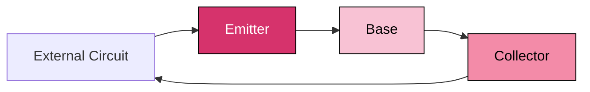
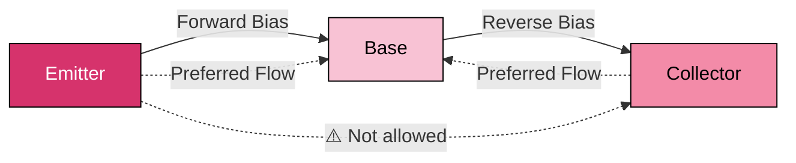
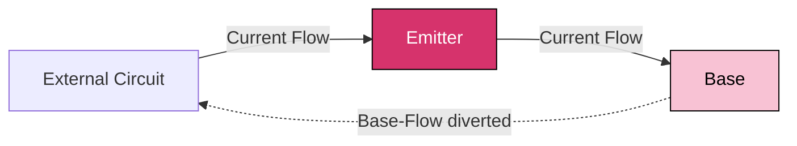
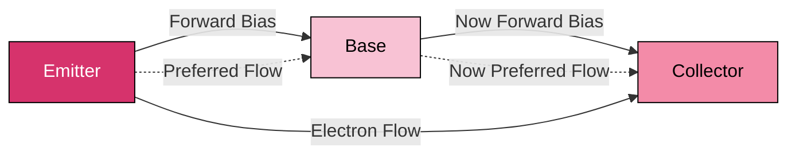

> [!note] Motivation
> This note aims to cover my mental derivation of the knowledge required all the way up to **Metal Oxide Semiconductor Field Effect Transistors (MOSFET)**

---

## 💡Switches

We want switches that we can control digitally, as in something that can switch between **ON** and **OFF** states

> [!tip] Requirements for a good switch
> **Basic Requirements**
> > ✅ At OFF state, blocks current **nearly completely**
> > ✅ At ON state, having **minimal current resistance**
> > ✅ Transition almost **instantly** between ON and OFF states

---

## ⚙️ Semiconductors

First, we need some kind of switch that can control between conducting and insulating through applying **electric potential difference**

We have found materials like this in their element and compound forms for what we call **semiconductors**

> [!example] Etymology
> **Semi-Conductors** are named so as they are **not fully conductive nor resistive**, sitting somewhere in between where they **conduct only under specific circumstances** are met, like under certain temperature or electric potential difference 

> [!info] Current State of Semiconductors
> Common semiconductor materials include:
> - **Silicon (Si)** – the most widely used, abundant, and well-understood.
> - **Germanium (Ge)** – used in early transistors and some high-speed applications.
> - **Gallium Arsenide (GaAs)** – used in high-frequency and optoelectronic devices.
> - **Silicon Carbide (SiC)** and **Gallium Nitride (GaN)** – used in power electronics for high voltage and temperature tolerance.
>
> These materials form the backbone of modern electronics, enabling everything from logic gates to solar cells.

---

## 🔧 Doping

> [!info] Switch Quality
> **Semiconductors in their raw form**
> > ❌ **Does not** block flow nearly completely in OFF state 
> > ❌ **Not conductive enough** to have minimal resistance in ON state
> > ❌ **Does not** have **sharp threshold changes** in conductivity
>
> Furthermore there are **unstable under temperature change**

We can solve the *conductivity* and *stability* issue together by **increasing the amount of mobile charge carriers** in the lattice structure

This is done through by combining with other elements to either 
- **Increase their negative charge carriers** (electrons) 
*OR*
- **Increase their positive charge carriers** (the "carriers" here are just lack of electrons—otherwise called *electron holes* or just *holes*) 

This process is called **doping**

> [!tip] Doping in Detail
> The term **doping** comes from early chemistry and metallurgy, meaning to **add a small amount of a foreign substance** to alter properties.
> 
> **N-Type** 
> > Adds atoms with **extra valence electrons** (e.g. Phosphorus, Arsenic) to Silicon, creating **free electrons**
>
> **P-Type**
> > Adds atoms with **fewer valence electrons** (e.g. Boron, Gallium), creating **electron holes**.

> [!info] Carrier Behavior
> **Electrons** are real particles that move through the lattice.
> 
> **Holes** are the absence of electrons in the valence band, and behave like **positive carriers** because electrons move to fill them.
> 
> Conceptually, both types of carriers contribute to current flow in electricity

> [!example] Terminology
> Doping-Types
> - Those with *elevated negative charge carriers* are called **Negative-Type Semiconductors**—or **N-Type** for short
> - Those with *elevated positive charge carriers* are called **Positive-Type Semiconductors**—or **P-Type** for short
>
> Purity-Types
> - *Raw* forms are labelled as **Intrinsic**
> - *Doped* forms are labelled as **Extrinsic**

---

## 🔗 P-N Junction and Depletion Regions

> [!note] Switch Quality
> **Doped semiconductors**
> > ❌ **Don't have a default-off state**, as they are too conductive
> > ✅ **Conductive enough** to have **minimal resistance** in ON state
> > ❌ **Does not** have **sharp threshold changes** in conductivity

When we combine **an N-type with a P-type semiconductors**, electrons from the N-side begin to **diffuse** into the P-side and recombine with holes.

`Recombination` leaves behind **fixed ionized atoms**—positive in the N-type and negative in the P-type—creating an **internal electric field** that opposes further diffusion

> [!tip] Terminology
> The boundary where diffusions happens across **N-Type** and **P-Type** Semiconductors is called a **P-N Junction** 

This forms a region near the junction where charge carriers are no longer mobile leaving only fixed charge carriers——or in another way that **mobile charge carriers are depleted**.

This is thus called the `Depletion Zone`

> [!info] Flow of Current  
> The flow of electrons will only resume when an electric potential difference is applied across the junction in the **direction of natural diffusion of majority carriers**, by weakening the internal barrier

---

## 🚪 Diodes

Through this structure, we have invented a **one-way gate** for charge carriers, called a **diode**  

> [!info] Etymology
> The term comes from *di-* for **“two”** and *-ode* for **“electrode”**—the two terminals where electricity flows

> [!example] One-Way Gate Behavior  
> Flow in the other direction would be **too difficult** to happen, unless:
> - **At low voltages** where a little bit leaks the other way——because of quantum tunneling
> - **Ultra high voltages** where the system is volatile and chain explosion of charge carrier flow can happen.

---

## 🧱 Side-by-Side P-N Junctions (NPN / PNP)

When we combine both the **N-Type** and **P-Type** Semiconductors, where one type is on both sides of the other type, **same-type charge carriers** cant flow from one side to the other side, as the preference would be to flow to the middle **opposite-type** semiconductor.

Thus, not flowing is the default. But we can make this a switch, thus we aim to find ways to allow current to flow from one end to another when we want to let it flow, and cut the connection when we don't want it to flow. 

> [!note] Switch Quality
> **NPN / PNP**
> > ☑️ **Blocks current nearly completely in OFF state** 
> > - Due to opposing preferred diffusion direction
> > 
> > ☑️ **Have minimal resistance to current in ON state** 
> > - Potentially when we can connect the same-type doped semiconductor on both ends
> > 
> > ☑️ **Transition almost instantly between ON and OFF states** 
> > - Potentially if switching between on and off states is **primarily controlled by potential difference** and not primarily by current

---

## 🔁 Transistor

By carefully biasing the junctions in an NPN or PNP structure, we create a **transistor**——a device that can **control current flow** using a small input signal, or rather a controlled semiconductor switch

> [!tip] What Makes It a Transistor?
> A transistor is a **controlled switch**:
> - A small current or potential difference at one terminal (the **base** or **gate**) can control a much larger current between the other two terminals.
> - This enables **amplification**, **switching**, and **logic control**.

There are two major types:
- **Bipolar Junction Transistor (BJT)**: current-controlled via base current
- **Field Effect Transistor (FET)**: voltage-controlled via gate voltage

We’ll begin with BJTs, then move to FETs (particularly **Inversion-based FETs commonly called MOSFETs**)

---

## 🔌 Bipolar Junction Transistor (BJT)

Following from the structure of the **side-by-side P-N Junctions**, we have the `Emitter` where charge carriers flow from and `Collector` where charge carriers flow into, and the middle block is called the `Base` where the flow of charge carriers are controlled
> **The `Base` is defined up front as it would be too tedious to explain this from scratch**

> [!info] Doping Levels  
> The 3 blocks are doped at different amounts:
> - The emitter is doped **highly** because it is where the charge carrier emits from  
> - The base is **thin** and doped **lightly**, so that there is minimal recombination when current is required to flow across its *opposite-type* semiconductor 
> - The collector is doped **moderately**, for the best balance between electric potential difference to the base and current from the base

### ⛔ Cut-Off State (Fully OFF)

The **opposite-facing** P-N Junctions means that even when a potential difference is applied from the `Emitter` to `Collector` (across the `Base`) current would not be able flow from the `Emitter` to the `Collector` under reasonable circumstances

This is thus also the default state of this structure, Logical OFF

### 🛠️ Initialise with Separate Potential Difference Biases (Active State)
Naturally between the emitter and base, current will easily flow if potential difference is applied in the **direction of emitter to base**, as that is in line with **the natural diffusion direction of majority carriers**

But between base and collector, the preferred direction would be collector to base. Since we need the current to flow from base to collector, the potential difference must be **applied in the opposite direction** of the natural diffusion direction of majority carriers

Thus, during initialisation, it is easier **apply separate electric potential difference bias**—emitter to base, and base to collector, to drive current

If it were to have both at forward-bias, it would **waste unnecessary amounts of energy trying to oppose its natural bias** during initialisation

### ⚠️ Current Through Opposite-Type Semiconductor
> [!warning]
> Because current has to flow through the *opposite-type* semiconductor in the middle——and the fact that it is **lightly doped for minimal resistance**——unregulated current will cause too many recombinations, greatly reducing the amount of *opposite-type* (minority) charge carriers
>
>  The *opposite-type* semiconductor thus **loses the ability to block nearly all current in its OFF state**, which would reduce the quality of the switch

To solve this, we can **divert some charge carriers away from the base** to maintain a healthy amount of recombination, so that the concentration of opposite charge carriers in the *opposite-type* semiconductor remains reasonable enough. 

This flow is called the **base-flow** which will flow out to the external circuit.

Moreover, since **base-flow** maintains a healthy potential difference between the emitter and the base—allowing charge carriers to flow smoothly—the transistor’s ability to operate **depends on this base-flow being sustained**

To take it even further, the **base-flow is the switch to turn on the entire transistor**

### ⚡ Transition to Saturation (Fully ON)

As **base current increases**, more majority carriers flood into the base while the collector keeps puling them out to the external circuit. 

But eventually the resistance of the external circuit will **bottleneck the rate at which the collector can pull them out**, causing majority carriers to build up at the base to a point where the **electric potential difference** is actually now **higher** at the base than the collector

This flips the **collector–base junction from reverse to forward bias**.

At this point, **both junctions are forward biased**—the transistor enters **saturation mode** and is considered **fully ON**, and **Logically ON**

### 🏷️ Naming Logic  

This construction is called a **Bipolar Junction Transistor**, or **BJT** for short.  
- **Bipolar** refers to both flow of **majority carriers** and flow of **minority carriers** involved 
  > It is commonly thought of as flow of **minority carriers** into the *opposite-type* semiconductor instead of **majority carriers** flowing away, although they are the same thing).  
- **Junction** is simply because of the P-N Junction used.

### 🍘 Inherent Flaw of Structure

We realised that for current to flow through the opposite-type semiconductor, a **base flow** of current must exist to hold enough potential difference for the current to continue flowing——other methods such as boosting potential difference would be **less economical**

Thus, a consistent flow of current is required to keep this transistor enabled, which consumes a non-negligible amount of extra power

If there were a way to have current flow through the opposite-type semiconductor **without relying on another current**, it would greatly **reduce the consumption of extra energy**

One of the ways of achieving this is to drive current through electric fields instead, as we will explore in our next section on `Field-Effect Transistors` (FETs) 

> [!note] Switch Quality
> **Bipolar-Junction Transistors**
> > ✅ **Blocks current nearly completely in OFF state** 
> > - Due to opposing preferred diffusion direction
> > 
> > ✅ **Has low resistance in ON state** 
> > - Because charge carriers move quickly from `Emiiter`, through the `Base`, to `Collector`
> > 
> > ❌ **Does not transition instantly between ON and OFF states**
> > - Because it takes time for charge carriers to **build up** in the base when turning ON, and to **clear out** when turning OFF

---

## 🔀 Inversion-Type Semiconductors——Preface

We will focus on a dominant subtype of FETs called **Inversion-Mode FETs**——most commonly recognized through their dominant subtype that became the namesake for this class——the **Metal Oxide Semiconductor Field-Effect Transistor (MOSFET)**

---

## ⚡ Metal Oxide Semiconductor Field-Effect Transistor (MOSFET)

Similarly, we follow from the construction of the **side-by-side P-N Junction**, mobile charge carriers can't flow from one side to another side, as the preference would be to flow to the middle semiconductor of opposing type.

### 🔖 Terminology Required for Basic Explanation

We shall name the **same-type semiconductors** at the start and end of the semiconductor block

The start of the block will be called the `Source` as it where mobile charge carriers are **supplied from**, 

And the end place of the block as `Drain` as it is where mobile charge carriers **Drain into**  

### 🌉 Bridge of Carriers

To allow current to flow, we would need to somehow connect the 2 same-types from `Source` to `Drain`, and have a way to control it

It would be like a switch that **lays a conducting bridge** between the `Source` and `Drain` whenever we want it to flow through the **opposite-type semiconductor**, and then remove the bridge whenever we don't want it to flow

We could make a physical bridge, but what if we want something faster, and more reliable? 

Physical switches after all are more **prone to breakage** and the switching process would be **slow**

> [!tip] Bridge of Mobile Charge Carriers
> Since we are already manipulating charge carriers, why not make the bridge out of the same charge carriers used at the `Source` and `Drain`?
>   
> We could make the charge carriers stay there when we want to using electric fields guide them 
> 
> The charge carriers always want to flow from **higher charge concentration** to **lower charge concentration**, so we will have to block them on the path between the `Source` and `GATE` to build a bridge at the *opposite-type* semiconductor in between

### 🧲 Dielectric Materials

Insulators alone could block charge carriers, but it **blocks electric fields** as well, we want the potential difference to be felt, so that the charge carriers will move, while blocking the charge carriers from flowing across it.

Luckily there are such materials that exhibit this quality, known as **dielectric** materials that 
- **Allows electric fields to pass through itself** 
- **Not allowing current to flow through it**

> [!info] Detailed Information on Dielectric Materials  
> These are materials that can still be polarised (electric-fields can pass through it) but its charge carriers are bound too tightly to the atoms to be mobile, thus conducting no electricity
> 
> Dielectric is a shorthand for *dia-* meaning **passing through**, and *electric*, which means **electric fields** in this case——*di-* is a common shortened variation for *dia-* when the start of the suffix is also a vowel  

### 🗼 Formation of Bridge

Once this is set up, simply set a terminal at the **bottom** of the block, and one **above the top** of the block, with the dielectric material right at the **surface of the top**

To create the bridge of charge carriers, a **potential difference** is applied between the bottom of the block, and **above the top** of the block.

The potential difference is applied primarily through a **metal piece** right on top of the **dielectric material**

The resulting **electric field** then **attracts** the charge carriers supposed to flow between the `Source` and `Drain` from within the *opposite-type* semiconductor towards the **top**, where they are stopped by the dielectric material, and accumulate to form the conductive bridge of charge carriers

### 🌊 Sustained Flow of Charge Carriers

This kickstarts the flow of current between the `Source` and `Drain`, that will now primarily maintain that bridge of charge carriers instead of from the *opposite-type* semiconductor

The **potential difference** between the **top** and the **bottom** must still remain applied to keep the bridge exactly at the **semiconductor-dielectric interface**

> [!tip] Inversion Layer  
> This bridge is commonly called the inversion layer, as it is a layer that is the **inversion of the charge** of the middle semiconductor  

> [!example] Terminal Naming  
> We have the `Source` and `Drain` **same-type semiconductors** already
>  
> The metal piece terminal on top where that **controls the bridge of mobile charge carriers** through having a lower applied electrical potential than the terminal at the bottom, is thus called the `GATE`  
> 
> The bottom terminal that also gets the charge carriers from the `Source`, but redirected before the terminal to the bottom terminal
> 
> It is called the **BULK** or **BODY** or **SUBSTRATE** as it is the foundational block that is used to fabricate the NPN block

> [!warning]
> This flow of charge carriers is **not called current**, as current refers to a **net flow of mobile charge carriers** in a closed circuit

### 🎚️ Evaluation

THUS, we have arrived at the currently most popular transistor, let's evaluate its switch quality

> [!note] Switch Quality
> **Metal Oxide Semiconductor Field-Effect Transistor**
> > ✅ **Blocks current nearly completely in OFF state** 
> > - Due to opposing preferred diffusion direction
> > 
> > ✅ **Has low resistance in ON state** 
> > - Because the electric field creates a dense, conductive channel between same-type `Source` and `Drain` regions
> > 
> > ✅ **Transition almost instantly between ON and OFF states** 
> > - As the bridge of charge carriers is set up immediately by the **fast-forming electric field** when potential difference is applied at the gate, 

### 🏷️ Naming Logic

Now that we've constructed the inversion-based FET, it's worth noting that the most popular type before the 2010s featured a gate stack where:
- The **dielectric material** was **silicon dioxide** *(oxide)*  
- The **gate electrode**—used to apply a potential difference—was **aluminium** *(metal)*

This layered structure gave rise to the namesake:  
**Metal-Oxide-Semiconductor Field-Effect Transistor (MOSFET)**

While modern MOSFETs no longer use those exact materials, the gate stack still consists of:
- A **metal gate electrode**
- An **oxide-based dielectric**

So the name remains apt—even as the materials evolve.

### 🎁 Extras

There are some variations of MOSFETs such as **Fin Field-Effect Transistors (FINFET)** that reduce the leakage of majority charge carriers at smaller scales by introducing a **vertical wall** in between the `Source` and `Drain` called a **Fin**

> [!tip] Why the Fin Improves Control 
> In traditional MOSFETs, the `Gate` only controls the channel from the **top**, which becomes less effective as the transistor shrinks. 
> 
> By shaping the channel into a **vertical fin**, the `Gate` can now **wrap around three sides**—left, right, and top—giving the electric field **more surface area** to act on. 
> 
> This allows the same `Gate` voltage to **grip the channel more tightly**, reducing leakage and improving switching precision at smaller scales.

And there is a newer type called **Gate-All-Around Field-Effect Transistors (GAAFETs)** that takes this idea even further by wrapping the gate around **all four sides** of the channel. 

While FinFETs offer **U-shaped coverage** around the fin, GAAFETs provide **tube-like or cage-like coverage**, giving the gate **complete electrostatic control**—like upgrading from a dome to a sphere.

### 🧩 Timeline of Field-Effect Transistor Evolution

| Era              | Technology     | Key Feature                                | Node Range       |
|------------------|----------------|---------------------------------------------|------------------|
| 1980s–2010s      | Planar MOSFET  | Gate on top only                            | >45nm            |
| ~2012 onward     | FinFET         | Gate wraps around 3 sides of vertical fin   | 14nm → 5nm       |
| ~2023 onward     | GAAFET         | Gate wraps around all sides of channel      | 3nm and below    |