A **decoder** is a digital logic circuit that translates binary input into a unique output line

Given $n$ binary inputs, it activates one of up to $2^n$ outputs—typically in **[[1️⃣ One-Hot vs One-Cold Encoding|one-hot]]** form

> [!info]
>
> - **Inputs**: $n$ binary signals
> - **Outputs**: $2^n$ one-hot lines, each a [[💡 Minterms and Maxterms#🔹 Minterms Strict Identifiers of ON States | minterm]] of the input space

```mermaid
graph TB
  subgraph Inputs
    A["A (MSB)"]
    B["B (LSB)"]
  end

  subgraph Decoder
    DEC["2-to-4 Decoder"]
  end

  subgraph Outputs
    Y0["Y₀"]
    Y1["Y₁"]
    Y2["Y₂"]
    Y3["Y₃"]
  end

  A --> DEC
  B --> DEC

  DEC --> Y0
  DEC --> Y1
  DEC --> Y2
  DEC --> Y3
```

---

## 🏷️ Naming

Decoder name follow the convention of: `Input-to-Output Decoder`

| Inputs | Outputs   | Notes           |
|--------|-----------|-----------------|
| $1$    | $2^1=2$   | 1-to-2 Decoder  |
| $2$    | $2^2=4$   | 2-to-4 Decoder  |
| $3$    | $2^3=8$   | 3-to-8 Decoder  |

---

## 🧮 Types

| Name             | Inputs | Outputs | Notes                                       |
|------------------|--------|---------|---------------------------------------------|
| Full Decoder     | $n$    | $2^n$   | Canonical one-hot mapping                   |
| Partial Decoder  | $n$    | $< 2^n$ | Decodes subset of combinations              |
| Invalid Mapping  | $n$    | $> 2^n$ | Cannot Decode greater than the maximum size |

---

## ⚙️ Applications

- **Instruction decoding** in CPUs
- **Memory addressing** (selecting word lines)
- **Display drivers** (activating segments)
- **Finite state machines** (state activation)
