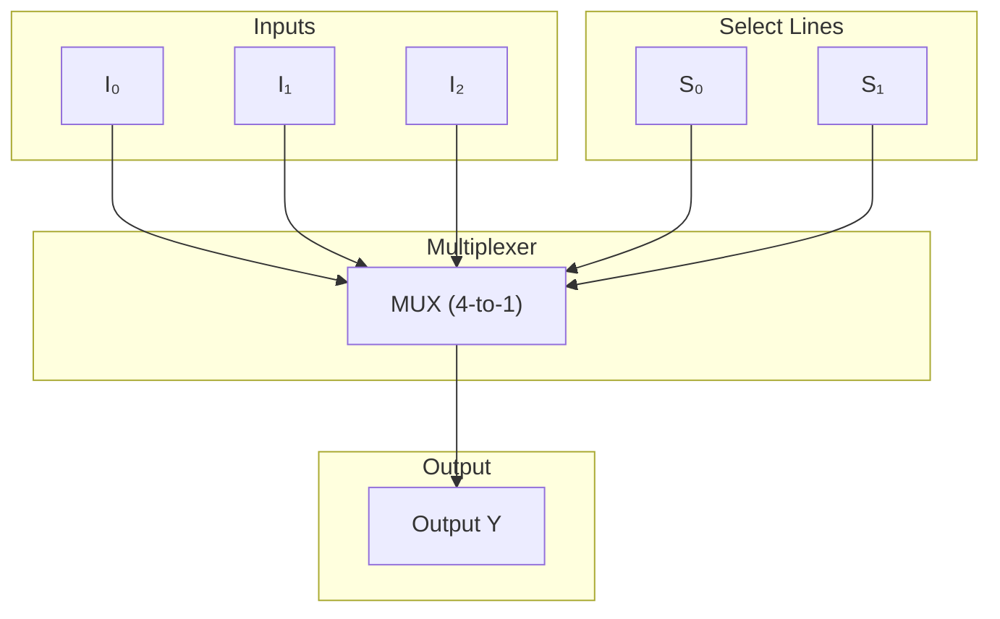

A **multiplexer** (MUX) is a digital logic device that selects **one input from many** and routes it to a **single output**, based on control signal called a **selector**

The multiplexer itself can be **thought of as a "selector"**, although the one that actually selects the output is **within the multiplexer**

> [!info]
> - **Inputs:** $n$ binary signals
> - **Output:** 1

> [!example] Notes
> MUX is often called a **data selector**.
> 
> Can be built using logic gates or hierarchical MUX trees.
> 
> In programming, MUX behavior resembles a **switch-case** or **if-else chain**

---

## ⚙️ Applications

- Data routing and bus control
- Function selection in ALUs
- Signal switching in communication systems
- Logic minimization and conditional operations

