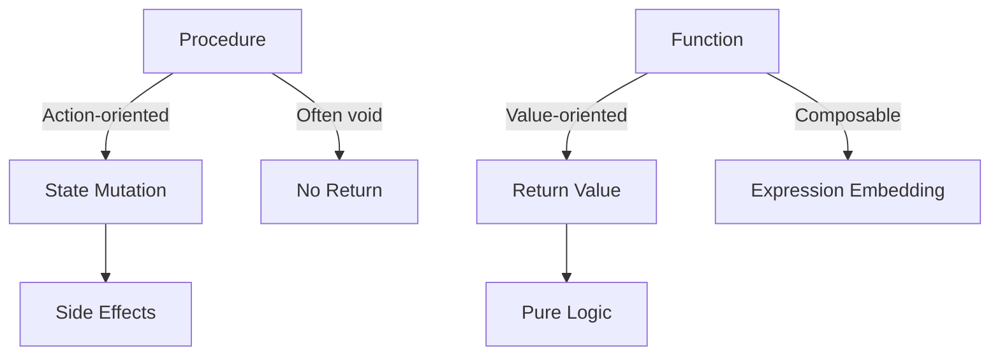

Understanding the distinction between procedures and functions is foundational in programming, logic design, and algorithmic reasoning.

---

## 🧩 Core Distinctions

| Feature                  | Procedure                              | Function                                |
|--------------------------|----------------------------------------|-----------------------------------------|
| **Return Value**         | No return value (void)                 | Returns a value                         |
| **Purpose**              | Executes a sequence of actions         | Computes and returns a result           |
| **Side Effects**         | Often modifies state or performs I/O   | Ideally pure (no side effects)          |
| **Composability**        | Harder to compose                      | Easily composable in expressions        |
| **Auditability**         | Requires tracing external effects      | Return value can be logged/tested       |
| **Mathematical Analogy**| Imperative statement                   | Mathematical function (f(x) = y)        |

---

## 🧠 Semantic Resonance Map

---

## 🧪 Example (Python)

    # Procedure
    def log_message(msg):
        print(f"Log: {msg}")  # Side effect: console output

    # Function
    def square(x):
        return x * x  # Pure computation

---

## 🧭 When to Use

- ✅ Use **procedures** for tasks like logging, file I/O, or system calls.
- ✅ Use **functions** for deterministic computations, transformations, and logic encapsulation.

---

## 🧱 Vault Integration Tips

- 🔒 Tag procedures with #side-effect and functions with #pure for audit clarity.
- 📦 Use semantic maps to trace dependencies and return lineage.
- 🧮 Benchmark function purity for optimization and testability.

---

## 🧘 Philosophical Note

Procedures embody *doing*, while functions embody *knowing*. In ethical systems, this parallels the distinction between consequentialist actions and deontological reasoning—one alters the world, the other reveals its structure.

---

## 📚 Further Reading

- Clean Code by Robert C. Martin
- Structure and Interpretation of Computer Programs (MIT Press)
